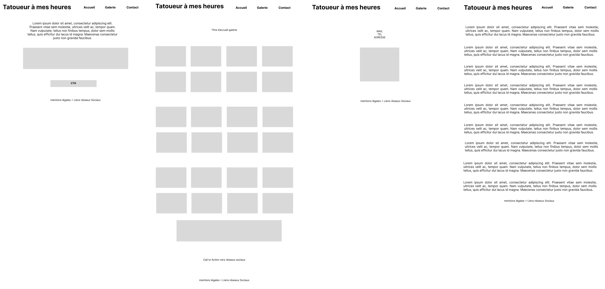
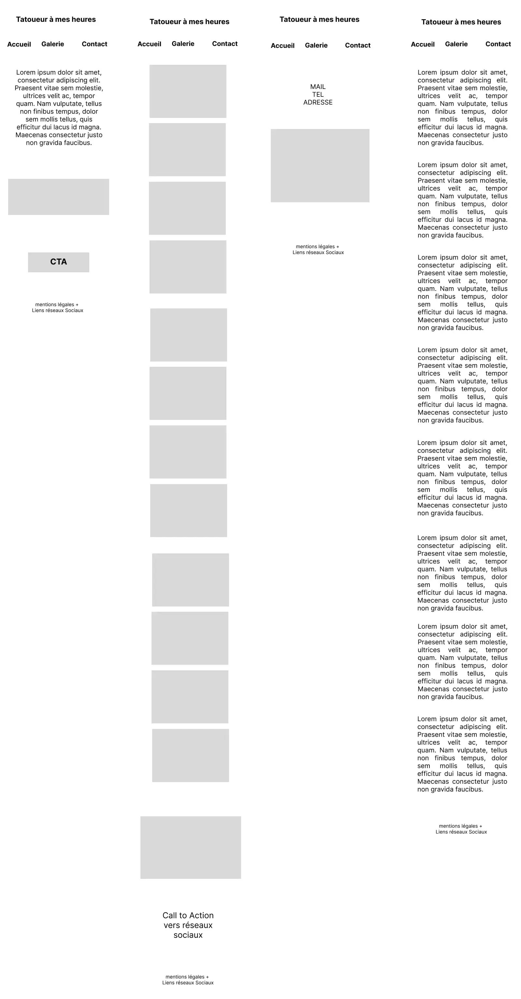
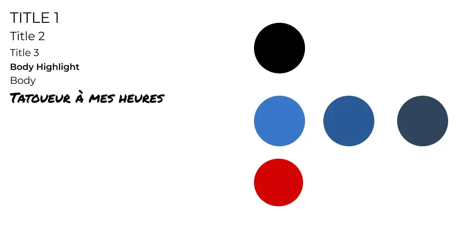
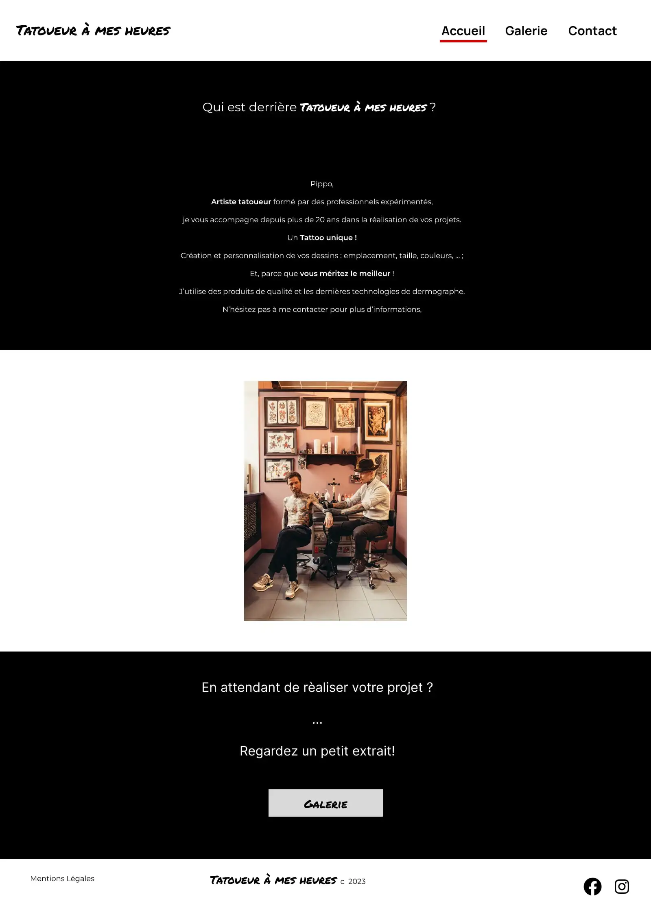
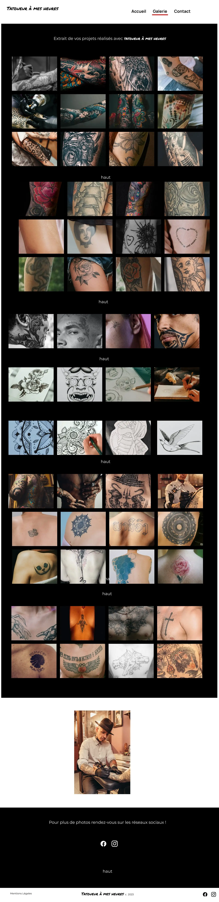
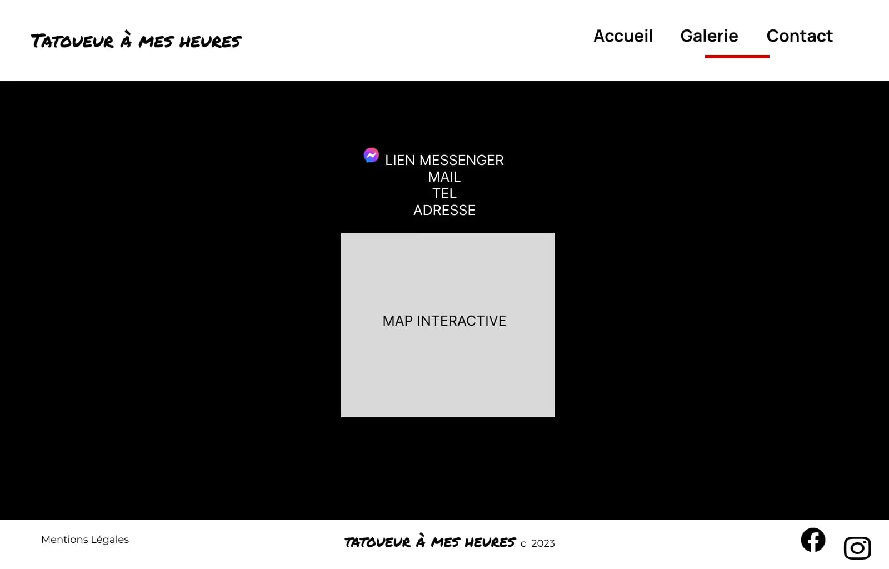
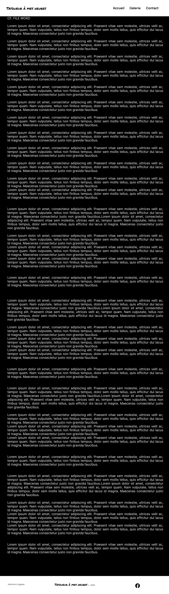

# TatoueurAMesHeures_Projet_old

In this repository, you will find the figma file of project and the lighthouse's report.

Dans ce dépôt vous trouverez le file figma du projet et le rapport lighthouse.

<a href="https://github.com/JoeWebDev70/TatoueurAMesHeures_old">Access to: Github repository</a>
 
<a href="https://www.figma.com/file/HJ5sz6GdiHD35PPHTTOfhz/TatoueurAMesHeures_old?type=design&node-id=0%3A1&mode=design&t=sErGIIUL2jweDyyx-1">Access to: Figma</a>

## Wireframe Desktop

 

## Wireframe Mobile

 

## Graphic Identity

 

## Accueil

 

## Galerie

 

## Contact

 

## Mentions Légales

